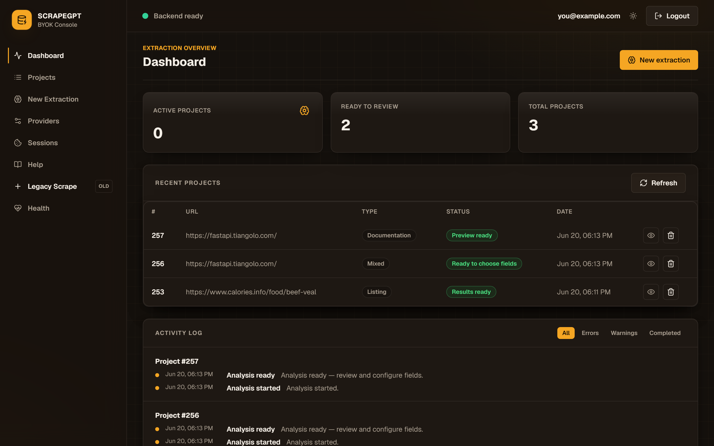
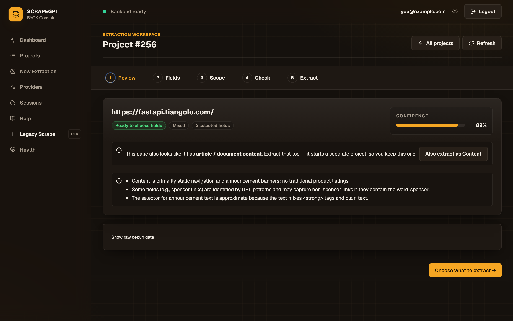
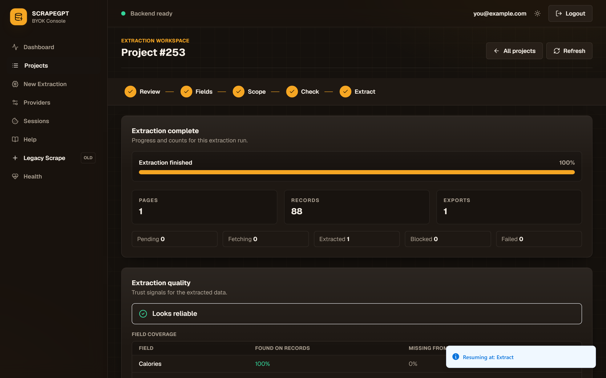
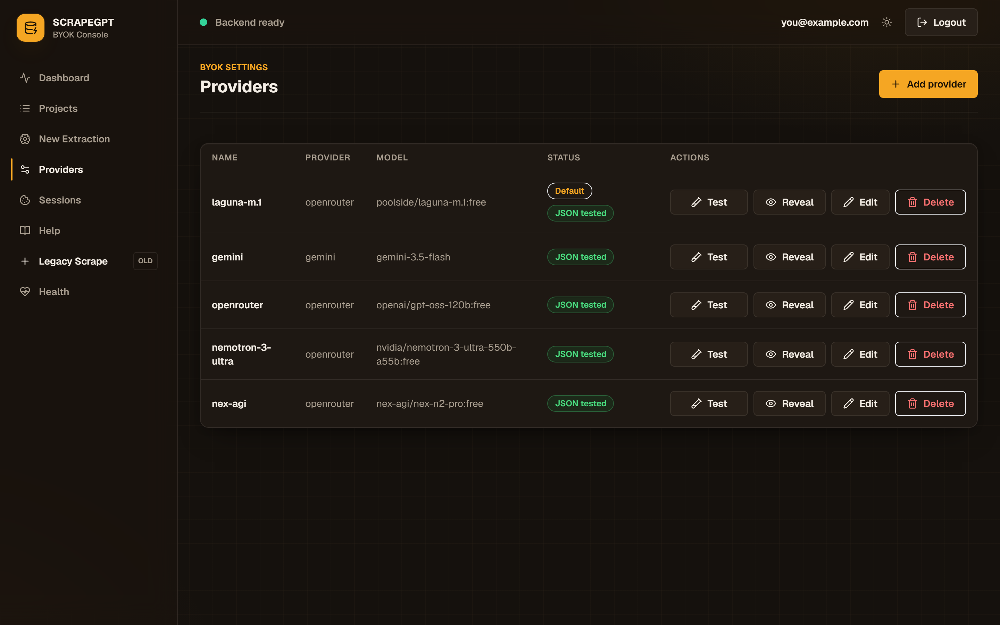
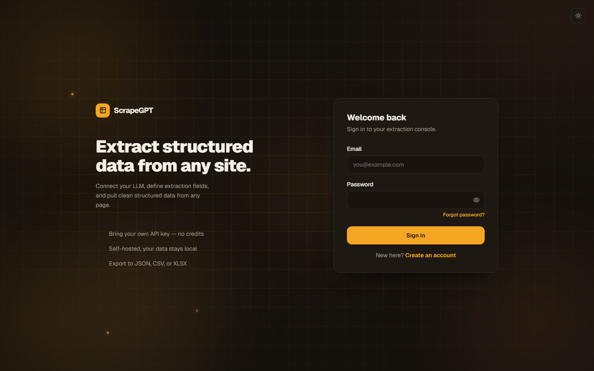
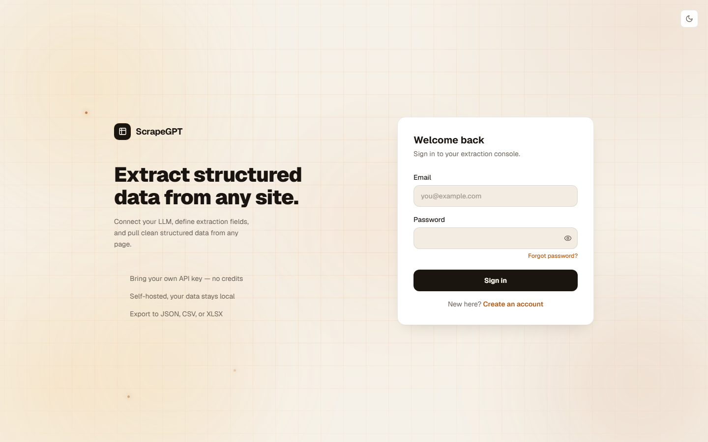
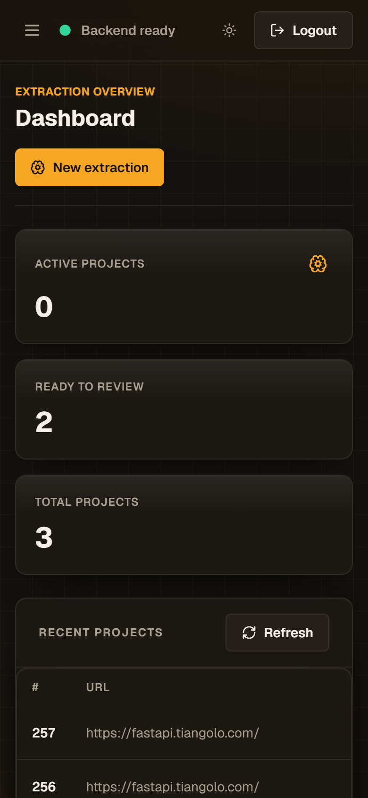

<p align="center">
  
</p>

<h1 align="center">ScrapeGPT</h1>

<p align="center">
  The open-source, self-hosted platform for turning any website into clean,<br />
  structured data &mdash; powered by your own LLM keys&nbsp;(BYOK).
</p>

<p align="center">
  <a href="#screenshots"><strong>Screenshots</strong></a> &middot;
  <a href="#features"><strong>Features</strong></a> &middot;
  <a href="#quick-start"><strong>Quick Start</strong></a> &middot;
  <a href="#tech-stack"><strong>Tech Stack</strong></a> &middot;
  <a href="#api"><strong>API</strong></a> &middot;
  <a href="#security"><strong>Security</strong></a>
</p>

<p align="center">
  <a href="LICENSE"></a>
  <a href="https://github.com/Sina-Amare/ScrapeGpt/stargazers"></a>
  <a href="https://github.com/Sina-Amare/ScrapeGpt/commits/main"></a>
  
  
</p>

<p align="center">
  <picture>
    <source media="(prefers-color-scheme: dark)" srcset="docs/screenshots/dashboard.png">
    <source media="(prefers-color-scheme: light)" srcset="docs/screenshots/dashboard-light.png">
    
  </picture>
</p>

---

**ScrapeGPT** turns any URL into clean, structured data. Point it at a page, let an AI model map the
extractable fields, preview the result on a live sample, then extract — and export to CSV, JSON, or
XLSX. It is **self-hosted** and **bring-your-own-key**: your data and your LLM provider keys stay on
your own infrastructure.

```text
URL  →  Understand data  →  Choose fields  →  Preview  →  Extract  →  Results
```

> **Status:** Phase 2.5 and reliability hardening are complete for the self-hosted single-instance
> workflow. See [docs/STATUS.md](docs/STATUS.md) for the current product surface and
> [docs/reviews/03_phase25_validation.md](docs/reviews/03_phase25_validation.md) for the Phase 2.5
> E2E validation evidence.

## Screenshots

A premium, responsive interface with first-class **light and dark** themes.

**Guided extraction workspace** — review the AI's page analysis, choose fields, set the crawl scope, preview a sample, then extract.

<p align="center">
  
</p>

**Results, trust signals & export** — server-side paginated records with field-coverage trust signals and one-click CSV / JSON / XLSX export.

<p align="center">
  
</p>

**Bring-your-own-key providers** — add your own LLM provider keys; encrypted at rest and tested before use.

<p align="center">
  
</p>

<table>
  <tr>
    <td width="50%"></td>
    <td width="50%"></td>
  </tr>
  <tr>
    <td align="center"><sub><b>Sign in &middot; dark</b></sub></td>
    <td align="center"><sub><b>Sign in &middot; light</b></sub></td>
  </tr>
</table>

<p align="center">
  
  <br />
  <sub><b>Fully responsive</b> — the entire workflow works down to phone widths.</sub>
</p>

## Features

- Premium, responsive React UI with light/dark themes and a guided, step-by-step extraction workspace.
- Auth with JWT access/refresh tokens.
- BYOK provider management with encrypted provider API keys.
- URL validation, robots checks, static HTML fetch, and optional Playwright browser rendering.
- AI-assisted page analysis for structured data and content extraction.
- Project workflow with saved extraction specs, field selection, selector preview, extraction, persisted records, and CSV/JSON/XLSX export.
- Phase 2.5 crawl-scope controls:
  - This page only
  - This list across pages
  - This dataset
  - The whole site
- Frontier preview showing included/excluded URLs and why.
- Scope confirmation gate for broad crawls.
- Extraction quality/trust signals.
- Server-side paginated results via `GET /api/v1/projects/{id}/records-page`.
- Structured logging with correlation IDs (`request_id`, `user_id`, `project_id`, `page_id`), auth event audit trail, provider key reveal audit, secret redaction pipeline. `LOG_FORMAT=json` for Docker.
- Reliability hardening: legacy `/scrape` SSRF validated at endpoint, executor, and redirect-hop levels; CrawlPage lease reaper; stuck-project watchdog; all-pages-failed projects transition to FAILED instead of zero-record COMPLETED.

## Tech Stack

<p>
  
  
  
  
  
  
  
</p>

| Concern | Stack |
|---|---|
| Backend | FastAPI, Uvicorn, SQLAlchemy 2 async, Pydantic 2 |
| Database | PostgreSQL 14+ with Alembic migrations |
| Auth | JWT via python-jose, passlib/bcrypt |
| Scraping | httpx, BeautifulSoup4, lxml, optional Playwright |
| AI providers | User-owned provider configs; provider keys encrypted with Fernet |
| Background work | FastAPI `BackgroundTasks`, APScheduler watchdog |
| Frontend | React 18, Vite, TanStack Query, Tailwind CSS |
| Tests | pytest, pytest-asyncio, tsx, React Testing Library |

## Quick Start

```powershell
# 1. Create and activate Python environment
python -m venv venv
.\venv\Scripts\activate

# 2. Install backend dependencies
pip install -r requirements.txt

# 3. Install frontend dependencies
cd frontend
npm install
cd ..

# 4. Configure environment
copy .env.example .env
# Edit .env: set DATABASE_URL, SECRET_KEY, and PROVIDER_KEY_ENCRYPTION_SECRET.

# 5. Apply database migrations
alembic upgrade head

# 6. Start backend
venv\Scripts\python.exe -m uvicorn app.main:app --reload --host 127.0.0.1 --port 8000

# 7. Start frontend in a second terminal
cd frontend
npm.cmd run dev
```

Open the frontend at [http://127.0.0.1:5050](http://127.0.0.1:5050).

If `DEBUG=true`, API docs are available at [http://127.0.0.1:8000/docs](http://127.0.0.1:8000/docs).

**Shortcut:** use the dev scripts to start/stop both servers in background processes:

```powershell
.\dev-start.ps1   # starts backend + frontend
.\dev-stop.ps1    # stops both
```

## API

All API routes are under `/api/v1`.

Primary project workflow:

| Method | Path | Purpose |
|---|---|---|
| `POST` | `/projects/analyze` | Create/analyze an extraction project |
| `GET` | `/projects` | List projects |
| `GET` | `/projects/{id}` | Project detail with spec, preview, frontier preview, quality, progress |
| `PATCH` | `/projects/{id}/spec` | Update fields, safety limit, export format, crawl scope |
| `POST` | `/projects/{id}/frontier-preview` | Generate/persist page frontier preview |
| `GET` | `/projects/{id}/frontier-preview` | Get latest frontier preview |
| `POST` | `/projects/{id}/preview` | Run sample selector preview |
| `POST` | `/projects/{id}/extract` | Start extraction |
| `GET` | `/projects/{id}/records-page` | Server-side paginated records |
| `GET` | `/projects/{id}/export` | Download CSV, JSON, or XLSX |
| `POST` | `/projects/{id}/cancel` | Cancel active project |
| `DELETE` | `/projects/{id}` | Delete project |

Other route groups:

- `/auth/*` for registration, login, refresh.
- `/providers/*` for BYOK provider configs.
- `/health`, `/health/live`, `/health/ready` for operations.
- `/jobs/*` compatibility layer over project analysis.
- `/scrape/*` legacy scrape task pipeline.

## Verification

Current verification snapshot from [docs/STATUS.md](docs/STATUS.md):

```powershell
# Backend
venv\Scripts\python.exe -m pytest -q

# Frontend
cd frontend
npm.cmd test
npm.cmd run typecheck
npm.cmd run lint
npm.cmd run build

# Phase 2.5 validation
venv\Scripts\python.exe tests\validation\run_validation.py
```

Last recorded results:

- Backend: 681 passed.
- Frontend: 89 passed; typecheck, lint, and build passed.
- Live HTTP API E2E (real public site): 8/8 scenarios passed.

## Security

- **Your data stays local.** ScrapeGPT is self-hosted; pages, extracted records, and exports never leave your infrastructure.
- **Provider keys are encrypted at rest** with Fernet and decrypted only on demand; reveals are audit-logged.
- **SSRF / DNS rebinding:** the static fetch path pins the connected peer IP, and the Chromium (Playwright) backend is pinned to the validated IP via `--host-resolver-rules`. The Camoufox and FlareSolverr backends cannot be pinned — if you enable them, restrict the app's outbound network (firewall / egress policy) to public destinations so private/loopback ranges are unreachable.

## Limitations

- The legacy `/scrape` pipeline remains for compatibility and is not the primary product path.
- A real AI provider is required for fresh provider-backed page analysis.
- Multi-worker durable crawler recovery is not implemented.
- Authenticated-content browser sessions are not implemented.
- CAPTCHA solving, stealth browser patches, proxy evasion, and challenge bypass are non-goals.

## Documentation

- [docs/STATUS.md](docs/STATUS.md) — current product state, not-implemented items, and verification snapshot.
- [docs/product/strategic_redesign.md](docs/product/strategic_redesign.md) — product roadmap and long-term architecture (Phases 3–6).
- [docs/README.md](docs/README.md) — full documentation map and reading guide.

## Contributing

Issues and pull requests are welcome. Please run the [verification](#verification) suite before opening a PR.

## License

[MIT](LICENSE)
